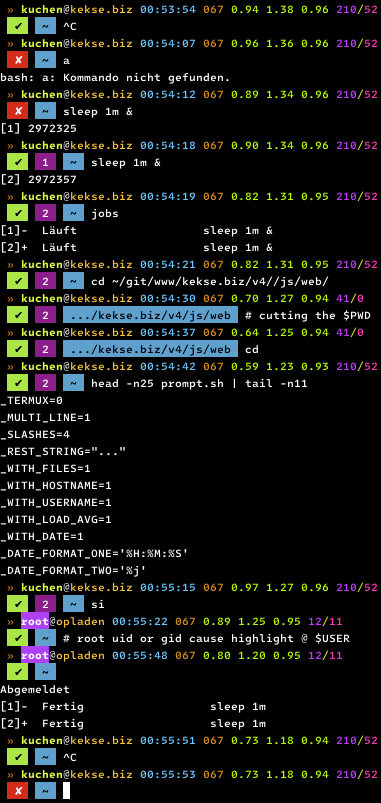

# Contact

| Key                      | Value                                                                                                                                                 |
| -----------------------: | :---------------------------------------------------------------------------------------------------------------------------------------------------- |
| 👋 **Website** (private) |         |
| 📫 **Mail** address      |  |

# **kekse1**'s

## Index
* [Repositories](#repositories)
* [Forks](#forks)
* [My **Prompt**](#my-prompt)
* [My **Favicon**](#my-favicon)

## Repositories
Here are my own repositories, *sorted by priority*.
Also to be found on my private website's **[`~projects`](https://kekse.biz/?~projects)** page.

#### Index

* [**`smartwatch`**](#smartwatch)
* [**`prompt`**](#prompt)
* [**`scripts`**](#scripts)
* [**`noto-emoji-animation`**](#noto-emoji-animation)
* [**`v4`**](#v4)
* [**`count.php`**](#countphp)
* [**`getopt.js`**](#getoptjs)
* [**`resize.php`**](#resizephp)
* [**`github-markdown.php`**](#github-markdownphp)
* [**`FakeSSH`**](#fakessh)
* [**`netz`**](#netz)
* [**`v3`**](#v3)
* [**`lib.js`**](#libjs)
* [**`count2`**](#count2)
<!--
* [**`norbert`**](#norbert)
* [**`brainstorm`**](#brainstorm)
  -->

### [**`smartwatch`**](https://github.com/kekse1/smartwatch/)
Since my bday 2023 I own a [Xiaomi Watch 2 Pro](https://kekse.biz/?~hardware).
Because I wanted a special watch face design (I really love 24h analog),
I decided to create my own one(s). So here's my [**`Biscuits Collection`**](https://biscuits.casa/)!

### [**`prompt`**](https://github.com/kekse1/prompt/)
Here's my notorious [**`$PS1`** prompt](https://github.com/kekse1/prompt/). *Just moved it from
the [`scripts`](#scripts) repository to it's own one*. Here's also the [example screenshot](#my-prompt).

### [**`scripts`**](https://github.com/kekse1/scripts/)
Mostly [**bash** shell](https://www.gnu.org/software/bash/) **scripts** (some for direct execution,
some for inclusion via `source` or `.`). Partially also JavaScript's, and atm even one C/C++..

### [**`noto-emoji-animation`**](https://github.com/kekse1/noto-emoji-animation/)
Google got it's own animated icon set, available via web interface (and github, too):

* [**Google**: The hub for everything animated emoji!](https://googlefonts.github.io/noto-emoji-animation/)
* [**Google**: Github repository](https://github.com/googlefonts/noto-emoji)

I hacked out a **mass downloader** here, plus an additional **PHP interface**, and even more.

### [**`v4`**](https://github.com/kekse1/v4/)
This is the current API documentation (etc.) for my [**private** website project](https://kekse.biz/).
Maybe you'd also like to see [the **source code**](https://kekse.biz/?~sources)?
Or maybe you want to see [all **my github projects**](https://kekse.biz/?~projects) in my own overview? `^_^`

### [**`count.php`**](https://github.com/kekse1/count.php/)
I really love it, so please give it a try! It even got a **CLI mode** (**C**onsole **L**ine **I**nterface)
to manage all the values etc. (in your file system) and also to view the current states.

Using the file system (but **not** a single file!) it's pretty efficient, and I made it **really** secure!
It has really many features and is highly customizable - even with extra config differences for each host,
which can be used in any amount.. and there's the configuration on the one hand, and on the other hand
there are many **`$_GET[]` parameters** to customize the output/drawing.

It supports both `text/plain` (or other mime/content types) and `image/*` drawing output.

The last feature I'd like to mention here is the (configurable) **`?text`** parameter to draw short text
strings instead of the counted values etc., e.g. to hide some info from automatic web crawlers/spiders/..
etc., e.g. when you want to present your eMail address or so, and scramble it a bit (see my address on my
[**`~impressum`**](https://kekse.biz/?~impressum) page, as an example 4u).

### [**`getopt.js`**](https://github.com/kekse1/getopt.js/)
My own `getopt` interpretation, written in plain/vanilla JavaScript (in fact based on my [**v4** **lib**/](#v4),
but you'll find a [**polyfill**](https://github.com/kekse1/getopt.js/blob/git/js/polyfill.js) there).

### [**`resize.php`**](https://github.com/kekse1/resize.php/)
Both for the **CLI** (**C**onsole **L**ine **I**nterface) and the **web browser** (so via **HTTPD**): a script
to resize images. Only **down**-scaling allowed, since **up**-scaling won't make any sense, for obvious reasons..

### [**`github-markdown.php`**](https://github.com/kekse1/github-markdown.php/)
A **PHP** script to convert **markdown to HTML** code, using the GitHub's API.

### [**`FakeSSH`**](https://github.com/kekse1/FakeSSH/)
This is my own **TODO**. My problem here: foreign people always try to hack my rooty, via Brute Force SSH attacks.
After using another port, they still found it. Using [`fail2ban`](https://github.com/fail2ban/fail2ban/) for a while
now helps .. a bit.

But now I'd like to create a fake SSHD using the default port. BUT there are some honeypots available; .. which I don't
really need, seem too bloated for my purpose.. and there are more reasons for this, so now I wanted to create my own
SSH server. Using [`Node.js`](https://nodejs.org/) (my all-time favorite! \^_\^);

### [**`netz`**](https://github.com/kekse1/netz/)
I needed a HTTPD w/ WebSocket support.. so I implemented it. Inclusive **own** WebSocket protocol parser/.. etc.
When it's "finished", I have to separate it from the rest of my project; after it, I'll upload it here.

### [**`v3`**](https://github.com/kekse1/v3/)
Basically only a screenshot left of my previous **v3** web design (the **private** one).
The code is deleted, since my newest [**v4**](#v4) is available right now.

### [**`lib.js`**](https://github.com/kekse1/lib.js/)
Only a memory of some older [**libjs.de**](https://libjs.de/) times.. the project ended some time ago, in it's
place now the newest [**v4**](#v4), respectively it's **`lib`/** part.

### [**`count2`**](https://github.com/kekse1/count2/)
_**Future** Plan(s)_ for a new [**`count.php`**](https://github.com/kekse1/count.php/);

> [!IMPORTANT]
> Currently suspended for a while (because my [**`Norbert`**](https://github.com/kekse1/norbert/)
> project enjoys all my free time atm.)!

<!--
### [**`norbert`**](https://github.com/kekse1/norbert/)
Only some notes to my own A.I. I'm researching on for nearly twenty years now.. there's nothing to be downloaded
or so, it's just a remark that my own `Norbert` is somewhere out there.. **`^_^`**

### [**`brainstorm`**](https://github.com/kekse1/brainstorm/)
My own **LLM** related stuff.. //**TODO**/!

It's under development.. at the moment the base structure is being planned and implemented, but it may change
from time to time.. and here's my addendum to [`count.php`](#countphp): this new **OO** design may really improve some things. ^\_^

> [!TIP]
> There'll be other modules beneath the `count2` which rely on my `kekse` PHP extensions.. example given: [ `post2`, `group2` ];
-->

## Forks
Some interesting repositories I wanted to mirror here.

* [**build-your-own-x**](https://github.com/kekse1/build-your-own-x/)
* [**llm-course**](https://github.com/kekse1/llm-course/)
* [**knowledge**](https://github.com/kekse1/knowledge/)
* [MS-DOS](https://github.com/kekse1/MS-DOS/)

## My [**Prompt**](https://kekse.biz/?github://kekse1/prompt/)

# My [**Favicon**](img/favicon.512px.png)

