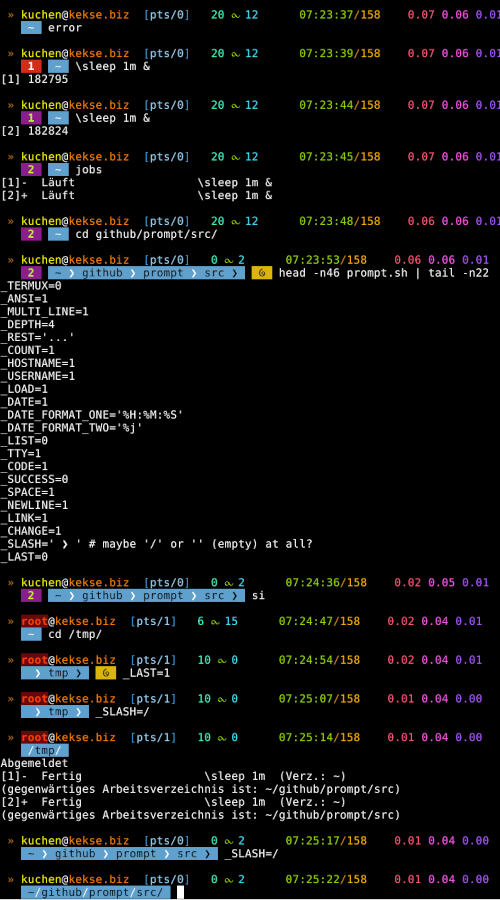
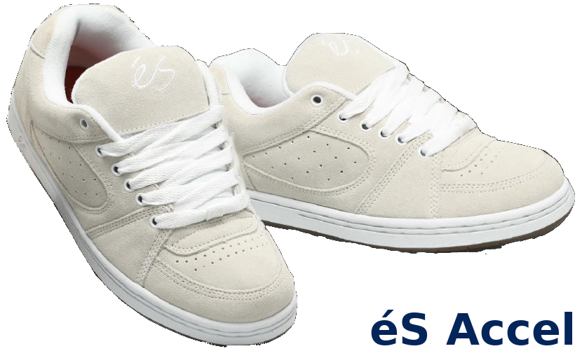

  

# **Kuchen**\`s

 

## Contact

| Key                      | Value                                                                                                                                                                           |
| -----------------------: | :------------------------------------------------------------------------------------------------------------------------------------------------------------------------------ |
| **Website**           |  |
| 📫 **Mail**              |                            |

 

> [!TIP]
> "What I cannot create, I do not understand." (Richard Feynman)

  

## Overview

* my [**Repositories**](#my-repositories)
* my [**Forks**](#my-forks)
* my [**Prompt**](#my-prompt)
* my [**FavIcon**](#my-favicon)
* my [**Links**](#my-links)
* my [**Sneakers**](#my-sneakers)

  

## my Repositories

[(**click here**)] Here are some of my own repositories, sorted by (kinda) priority.

> [!IMPORTANT]
> This is **not** 

 

#### Index

* [**`PROMPT`**](#prompt)
* [**`Smartwatch`**](#smartwatch)
* [**`Field`**](#field)
* [**`Dump.js`**](#dumpjs)
* [**`Scripts`**](#scripts)
* [**`JavaScripts`**](#javascripts)
* [**`Erase.js`**](#erasejs)
* [**`asleep`**](#asleep)
* [**`JSON.js`**](#jsonjs)
* [**`ANSI.js`**](#ansijs)
* [**`noto-emoji-animation`**](#noto-emoji-animation)
* [**`RADIX`**](#radix)
* [**`v4`**](#v4)
* [**`count.php`**](#countphp)
* [**`unwiki`**](#unwiki)
* [**`getopt.js`**](#getoptjs)
* [**`nproc.c`**](#nprocc)
* [**`levenshtein.js`**](#levenshteinjs)
* [**`PointerCaptureStack`**](#pointercapturestack)
* [**`PHP`**](#php)
* [(all Repositories)](#all-repositories)

    

### Prompt (`$PS1`)

Here's my notorious [**`$PS1`** prompt](https://github.com/kekse1/prompt/),
using the `$PROMPT_COMMAND` dynamics. Also see [below](#my-prompt).

  

### Smartwatch

Since my bday 2023 I own a [Xiaomi Watch 2 Pro](https://kekse.biz/?~hardware).
Because I wanted a special watch face design (I really love 24h analog),
I decided to create my own one(s). So here's my [**`Biscuits Collection`**](https://biscuits.casa/)!

  

### Field

This is the best[tm] way to manage multi-dimensional arrays (of **any type**).

> [!NOTE]
> Available as **JavaScript** implementation, and there's also a
> (much smaller) **Bash Shell** version available.

  

### Dump.js

My own **Radix Viewer**. First version with only **viewing** functionality.

> [!NOTE]
> When I talk about the **radix**, I mean the numeric **base** (decimal, binary/dual, ..).

I really needed such a tool for myself to develop/debug my `Norbert`,
and since I also needed other tools for this reason, I just implemented 'em here, too.

The available utilties are explained in the README, too; they're some extensions to this cool tool,
and I implemented them when there was the need for \[speed\]: ...
[ **`count`**, **`sum`**, **`rot13`**, **`print`**, **`xml`**, **`ansi`** ];

  

### Scripts

Only (my own) [**bash** shell](https://www.gnu.org/software/bash/) **scripts**.

Some are for direct execution, some for inclusion via `source` or `.`
(likely in the `/etc/profile.d/` directory).

My [`JavaScripts`](#javascripts) moved to their own [`JavaScripts` repository](https://github.com/kekse1/javascripts/)
\[2024-09-24\], and my `nproc.c` (ANSI C) also moved to it's own [`nproc.c`](#nprocc) [repository](https://github.com/kekse1/nproc.c/).

  

### JavaScripts

This started by moving all the JavaScripts from my [**`scripts`**](#scripts) repository.

  

### Erase.js

The plan is to wipe all the [**Termux Linux**](https://termux.dev/) files
on my smartphone (more/less) securely.. by traversing a directory and
overwriting all files with exactly the same amount of `\0` or random bytes.

Without jailbreak one can't `dd` the whole disk drive(s).
So I needed to do this directly on file level..

  

### asleep

My own, better `sleep` replacement. Vanilla JavaScript, without any dependencies.

  

### JSON.js

Just started this one, since I needed to insert comments in my
[**JSON configuration**](https://github.com/kekse1/scripts/#configjs).

  

### ANSI.js

Extensions for **JavaScript**/[**Node.js**](https://nodejs.org/) of **ANSI Escape Sequences**.

> [!TIP]
> There's also the [scripts/**ansi.sh**](https://github.com/kekse1/scripts/#ansish).

  

### noto-emoji-animation

Google got it's own animated icon set, available via web interface (and github, too):

* [**Google**: The hub for everything animated emoji!](https://googlefonts.github.io/noto-emoji-animation/)
* [**Google**: Github repository](https://github.com/googlefonts/noto-emoji)

I hacked out a **mass downloader** (JavaScript/[Node.js](https://nodejs.org/)); plus an additional **TAG-LOOKUP interface**
(PHP script, but also usable via Shell), and more.

See also this [example screenshot](https://github.com/kekse1/noto-emoji-animation/blob/git/img/shell.png) of the
**tag lookup** interface, here used in the **shell**.

  

### RADIX

Radix/base/unit/.. conversions. **JavaScript** code.

  

### v4

This is the current API documentation (etc.) for my [**private** website project](https://kekse.biz/).
Maybe you'd also like to see [the **source code**](https://kekse.biz/?~sources)?
Or maybe you want to see [all **my github projects**](https://kekse.biz/?~projects) in my own overview? `^_^`

  

### count.php

I really love it, so please give it a try! It even got a **CLI mode** (**C**onsole **L**ine **I**nterface)
to manage all the values etc. (in your file system) and also to view the current states.

Using the file system (but **not** a single file!) it's pretty efficient, and I made it **really** secure!
It has really many features and is highly customizable - even with extra config differences for each host,
which can be used in any amount.. and there's the configuration on the one hand, and on the other hand
there are many **`$_GET[]` parameters** to customize the output/drawing.

It supports both `text/plain` (or other mime/content types) and `image/*` drawing output.

The last feature I'd like to mention here is the (configurable) **`?text`** parameter to draw short text
strings instead of the counted values etc., e.g. to hide some info from automatic web crawlers/spiders/..
etc., e.g. when you want to present your eMail address or so, and scramble it a bit (see my address on my
[**`~impressum`**](https://kekse.biz/?~impressum) page, as an example 4u).

  

### getopt.js

My own `getopt` interpretation, written in plain/vanilla JavaScript.

  

### unwiki

Converts [Wikimedia Dumps](https://dumps.wikimedia.org/) to big **`test/plain`** files.

  

### nproc.c

Tiny extension to the well-known coreutil: by setting the `NPROC` environment variable to an
arbitrary integer that value will be shown instead of the real core/thread count of your CPU.

  

### Levenshtein

This algorithm calculates the 'distance' between words. It's often used to give a user
possible alternative words/commands/.. etc. if one typed in a 'wrong' command, e.g.

  

### Pointer Capture **Stack**

Extending the **Pointer Events API** a little bit. ..

  

### PHP

Many, many years ago I was a Moderator in the PHP area of the "Buschhacker" forum,
l8rs even a "Technical Administrator". So maybe I didn't forget *that* much about PHP!?

  

### (all Repositories)

And here is the [complete **repository** list](https://github.com/kekse1?tab=repositories).

    

## my Forks

[(**click here**)] Some interesting repositories I wanted to mirror here (that's the reason I fork).

Some interesting repositories I wanted to mirror here. That's the reason I fork,
and because I'll find these nice projects l8rs again..

* [**build-your-own-x**](https://github.com/kekse1/build-your-own-x/)
* [**llm-course**](https://github.com/kekse1/llm-course/)
* [**knowledge**](https://github.com/kekse1/knowledge/)
* [**RadixRedux**](https://github.com/kekse1/RadixRedux/)
* [**c64ref**](https://github.com/kekse1/c64ref/)
* [**deep-tempest**](https://github.com/kekse1/deep-tempest/)
* [**gr-tempest**](https://github.com/kekse1/gr-tempest/)
* [**tempest-lcd**](https://github.com/kekse1/tempest-lcd/)
* [**games**](https://github.com/kekse1/games/)
* [**doom-ascii**](https://github.com/kekse1/doom-ascii/)
* [**forkrun**](https://github.com/kekse1/forkrun/)
* [**awesome-bash**](https://github.com/kekse1/awesome-bash/)
* [**CL4R1T4S**](https://github.com/kekse1/CL4R1T4S/)
* [**system_prompts_leaks**](https://github.com/kekse1/system_prompts_leaks)
* [**Singularity**](https://github.com/kekse1/Singularity/)
* [**craftgpt**](https://github.com/kekse1/craftgpt/)
* [**phoenix**](https://github.com/kekse1/phoenix/)
* [**raytracing.github.io**](https://github.com/kekse1/raytracing.github.io/)
* [**remove-refusals-with-transformers**](https://github.com/kekse1/remove-refusals-with-transformers/)
* [**hk**](https://github.com/kekse1/hk/)
* [**llama3pure**](https://github.com/kekse1/llama3pure/)
* [**nanochat**](https://github.com/kekse1/nanochat)
* [**x86CSS**](https://github.com/kekse1/x86CSS/)
* [**IPTV**](https://github.com/kekse1/IPTV/)
* [**artificial-life**](https://github.com/kekse1/artificial-life/)
* [**llm.c**](https://github.com/kekse1/llm.c/)
* [**llama2.c**](https://github.com/kekse1/llama2.c/)
* [**autoresearch**](https://github.com/kekse1/autoresearch/)
* [**awesome-opensource-ai**](https://github.com/kekse1/awesome-opensource-ai/)
* [**guppylm**](https://github.com/kekse1/guppylm/)
* [**mempalace**](https://github.com/kekse1/mempalace/)
* [**thunderbolt**](https://github.com/kekse1/thunderbolt/)
* [MS-DOS](https://github.com/kekse1/MS-DOS/) (Archived)

    

## my Prompt

[(**click here**)] See also my [**Prompt**](#prompt) repository.

    

## my [FavIcon](https://kekse.biz/)

    

## my [Links](https://kekse.biz/?~links)
* [**`kekse.biz`**](https://kekse.biz/)
* [**`biscuits.casa`**](https://biscuits.casa/)
* [**`leverkusen.li`**](https://leverkusen.li/)
* [**`256.zone`**](https://256.zone/)
* [**`facebook.com/geleeschaumgummi/`**](https://facebook.com/geleeschaumgummi/)
* [**`linkedin.com/in/quantenmechaniker/`**](https://linkedin.com/in/quantenmechaniker/)
* [**`facer.io/u/kekse/`**](https://facer.io/u/kekse/)

    

## my [Sneakers](https://etnies.com/)

